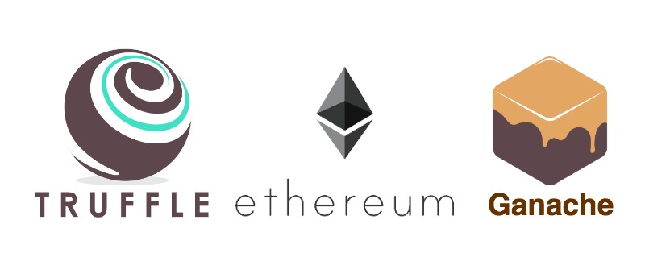

## Truffle Events

<center>
  
</center>

A simple utility library to form a transaction for deep event testing i.e. `approveAndCall` function. Works best with '[truffle-assertions](https://yarnpkg.com/en/package/truffle-assertions)' library.

- [Yarn](https://yarnpkg.com/en/package/truffle-events)
- [NPM](https://www.npmjs.com/package/truffle-events)

### Why I Created This Library?

If you are doing something like `approveAndCall` function, you might have events inside 2 or more contracts. I called them as 'deep events'.

At first, I thought it was a Ganache [issue](https://github.com/trufflesuite/ganache/issues/833). But, after spending some time experimenting with it, I can confirm that this issue was not only happened in Ganache. It happened in Geth too.

After some research, I found [this answer](https://ethereum.stackexchange.com/a/48389/26362). That explains a lot. Only events that were emitted from the contract test scope will be returned.

For example:

```
pragma solidity ^0.4.24;

contract Foo {
    event LogNumber(uint256 number);

    function doSomething() public {
        emit LogNumber(100);
    }

    function doSomethingExtra(address bar) public {
        emit LogNumber(100);
        Bar b = Bar(bar);
        b.doSomething();
    }
}

contract Bar {
    event LogAlphabet(string word);

    function doSomething() public {
        emit LogAlphabet("Hello!");
    }
}
```

In above example, if you are testing `doSomethingExtra()`, you will only get `LogNumber` event inside the transaction object:

```
// code omitted for brevity

var tx = await foo.doSomethingExtra(); // has no `LogAlphabet` event inside

// code omitted for brevity
```

But, if you check the [transaction receipt](https://github.com/ethereum/wiki/wiki/JSON-RPC#eth_gettransactionreceipt), you will actually see 2 logs were emitted (well, that's what we expect and should be).

But, the result is not in decoded form. You need some knowledge to [decode the events](https://codeburst.io/deep-dive-into-ethereum-logs-a8d2047c7371) from that transaction receipt result. Tip: you can use this [online tool](https://emn178.github.io/online-tools/keccak_256.html) to generate your event's hash.

Lucky enough, I found a [library](https://github.com/ConsenSys/abi-decoder/) by Consensys to help us with events decoding. This Truffle Events is using that `abi-decoder` library as dependency.

### How It Works?

Since the `truffle-assertions` library require a transaction object with decoded events, what I did here is basically decode the emitted event that we have in another contract/receiver contract and form a minimal transaction object that is compatible with `truffle-assertions` library.

### Usage

Install the package:

```
$ yarn add truffle-events
$ npm i truffle-events
```

The magic:

```
// all 3 arguments are required
truffleEvent.formTxObject('ContractName', eventIndex, txScope);

// example based on 2 contracts above
var barScope = truffleEvent.formTxObject('Bar', 1, fooScope);
```

Test example:

```
var truffleAssert = require('truffle-assertions');
var truffleEvent  = require('truffle-events');

// code omitted for brevity

it("Foo#doSomethingExtra", async function(){
  var fooScope = await f.doSomethingExtra(b.address);
  var barScope = truffleEvent.formTxObject('Bar', 1, fooScope);

  truffleAssert.eventEmitted(fooScope, 'LogNumber', (ev) => {
    return ev.number == 100;
  });

  truffleAssert.eventEmitted(barScope, 'LogAlphabet', (ev) => {
    return ev.word == "Hello!";
  });
});
```

### Contributing

Feel free to fork and submit your PR. I'm happy to review and merge it. As for issues, I can't promise any support at this moment.

### License

This package is released under [MIT](https://choosealicense.com/licenses/mit/) license.
